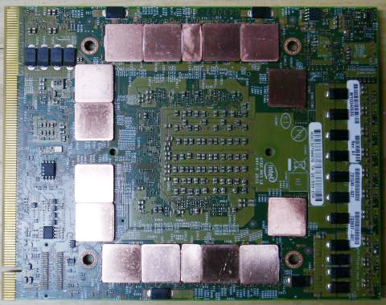
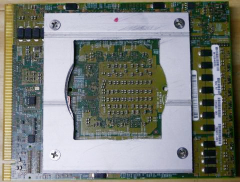
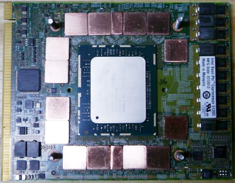
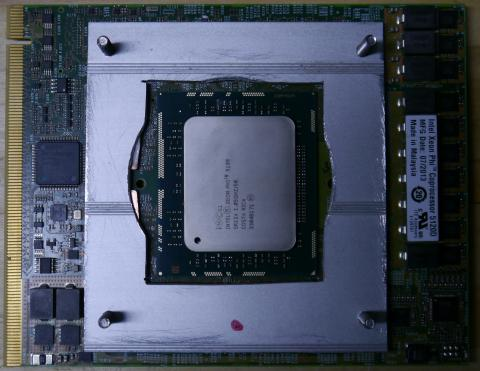
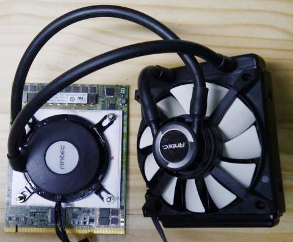
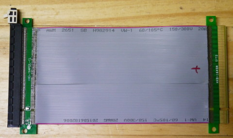
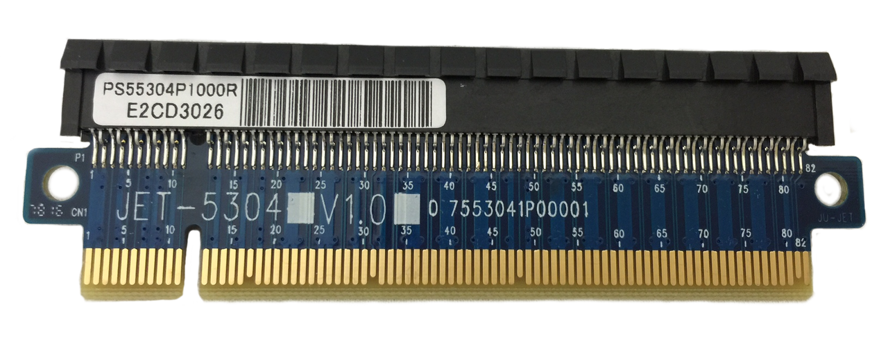
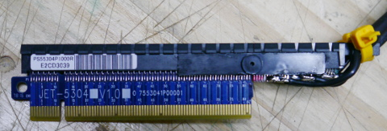
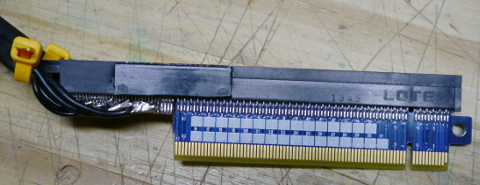

# xphi
Xeon Phi board bring up

## Hardware

### Setup
- Intel® Xeon Phi™ Coprocessor 5120D [Intel Xeon Phi Datasheet](http://www.intel.com/content/dam/www/public/us/en/documents/datasheets/xeon-phi-coprocessor-datasheet.pdf)
- Z97 mini-ITX Motherborad ???
- PCIe x16 to x24 converter (todo)

### Thermal solution
Board has 4 x M4 mount holes with 81 x 85 spacing.

All layers connected using white thermal compound.

Both sides use similar (compound + copper + compound + aluminum) passive cooling solution for GDDR 5 chips.

### 2015-10-10 Build session:
#### Bottom side memory
Assembly starts from the bottom side of PCB.

Copper shim pads 15 x 15 mm. On top of 16 GDDR5 chips. Two halfs in the top and the bottom row.

Had-cut / scrape aluminum panel fixing copper shim pads:

4 x M4 x 25 screws via nylon washers keeping all attached to the PCB.

#### Top side memory
Copper shim pads are very similar for the bottom story.

Similar aluminum piece. Holes are M4 threaded.

Two Aluminum plates screwed together. The rest of the screws pops up and will be used for CPU cooler attachment.

#### CPU
Using Antec KÜHLER H2O 650 Liquid cooling solution ($39) for the CPU.

Cooler bracket requires trimming to non-standard 81 x 85 holes.

#### ToDo
- Apply final thermal compound to the CPU
- how to monitor temperatures? control FAN speed?

### PCIe x16 to x24 converter
Phi board comes with x24 edge connector, that is not compatible with ANY reasonable (available) Motherboard. The x24 connector using only 16 of PCIe lanes, and uses ther rest of pads for +12V power delivery.
- PCIe x16 provides 1-82 A-B pins
- A/B 83-87 are reserved

top     | sig        | botom   | sig | from
------- | ---------- | ------- | --- | -------------
B1-82   |            | A1-82   |     | from PCIe x16 |
B83     | ???        | A83     | NC  |               |
B84     | ???        | A84     | NC  |               |
B85     | PWR/GND??? | A85     | GND |               |
B86     | NC         | A86     | NC  |               |
B87     | NC         | A87     | NC  |               |
B88-115 | +12V       | A88-115 | GND |               |

Our plan:

#### ~~Option 1~~
- [PCIe x16 extention cable](http://amzn.com/B00D79EV0G) $7
- Remove PCIe x16 connector from the extender
- Solder PCIe x24 230 positions connector (STRADDLE MOUNT) ~$12
- Solder Power cable

#### ~~Option 2 :+1:~~
- [PCIe x16 extention cable](http://amzn.com/B00D79EV0G) $7 (I received 2 extenders)
- Trim x16 connector on the extender
- Trim one more PCIe connector
- Glue second connector to the extender
- Solder Power cable

### ~~Option 3~~
- [PCIe Riser Card x16](http://amzn.com/B002M1DHJG) $15
- Rework PCIe connector to PCIe x24

#### Common
Both options require power cable modular PSU 2 x 8-pin (+12v) GPU connectors (2 x 150W)?

### 2015-10-12 Build session:
Received two [PCIe x16 extention cable](http://amzn.com/B00D79EV0G) $7

Testing with GPU card showed electrical problems.

Found several wires in the air!

Started resoldering cable.

### 2015-10-17 Build session:
After faling several attempts to resolder the extention cable,
we have decided to unsolder wires, and use only hal of it.
The problem, is that 2-side PCB was so cheap that several copper pads came-off the board.
That made the board more or less useless.

For the next attempt we ordered JET-5304 PCI Express X16 Extender. ($11)

We are going to check it with GPU card,
and then rework the connector x16 to x24 with extra +12V power if first step is successfull.

### 2015-10-24 Build session:
PCIe x16 riser board, PCIe x16 connector, hacksaw, superglue and ... we build extended x16 to x24 riser board.

Power cable (+12V) soldered directly to the connector and has 8-pin connector compatible with EVGA Supernova PSU.

### 2015-10-24 Smoke test
My Z97 computer failed to boot with Xeon Phi board in. Xeon Phi on-board LED blinks 8Hz. Power consumption is normal. We have to try with more advanced chipset tomorrow.

### 2015-10-25 Smoke test
[@alexei-v-ivanov](https://github.com/alexei-v-ivanov) sucessfully booted in X79 computer: [ASUS P9X79-WS build](ASUS_P9X79-WS_build.md)
