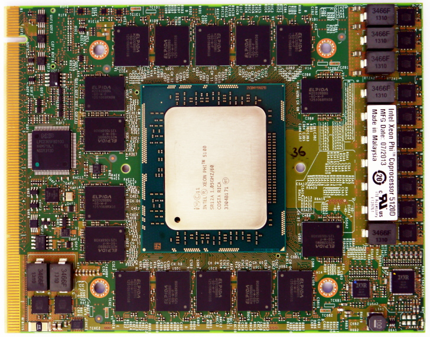

# xphi
Xeon Phi board bring up

## Hardware

### Setup
 - Intel® Xeon Phi™ Coprocessor 5120D [Intel Xeon Phi Datasheet](http://www.intel.com/content/dam/www/public/us/en/documents/datasheets/xeon-phi-coprocessor-datasheet.pdf)
 - Z97 mini-ITX Motherborad ???
 - PCIe x16 to x24 converter (todo)

### Thermal solution
81 x 85 mm mount holes (3.8mm) diameter.

 - 200W cooler for the Phi.
 - top GDDR5 radiator x 4 sides
 - back GDDR5 radiator x 4 sides

### PCIe x16 to x24 converter

Phi board comes with x24 edge connector, that is not compatible with ANY reasonable (available) Motherboard.
The x24 connector using only 16 of PCIe lanes, and uses ther rest of pads for +12V power delivery.

 - PCIe x16 provides 1-82 A-B pins
 - A/B 83-87 are reserved

top | sig | botom | sig | from |
--- | --- | ----- | --- | ---- |
B1-82|    | A1-82 |   | from PCIe x16 |
B83 | ??? | A83   | NC  ||
B84 | ??? | A84   | NC  ||
B85 | PWR/GND??? | A85 | GND ||
B86 | NC  | A86   | NC  ||
B87 | NC  | A87   | NC  ||
B88-115 | +12V | A88-115 | GND ||

Our plan:

#### Option 1
 - [PCIe x16 extention cable](http://amzn.com/B00D79EV0G) $7
 - Remove PCIe x16 connector from the extender
 - Solder PCIe x24 230 positions connector (STRADDLE MOUNT) ~$12
 - Solder Power cable

#### Option 2 :+1:
 - [PCIe x16 extention cable](http://amzn.com/B00D79EV0G) $7
 - Trim x16 connector on the extender
 - Trim one more PCIe connector 
 - Glue second connector to the extender
 - Solder Power cable

### Option 3
 - [PCIe Riser Card x16](http://amzn.com/B002M1DHJG) $15
 - Rework PCIe connector to PCIe x24

#### Common
Both options require power cable modular PSU 2 x 8-pin (+12v) GPU connectors (2 x 150W)?

## Software
https://software.intel.com/en-us/articles/intel-manycore-platform-software-stack-mpss#lx36rel
https://github.com/pentschev/mpss-modules
https://github.com/ispc/ispc
